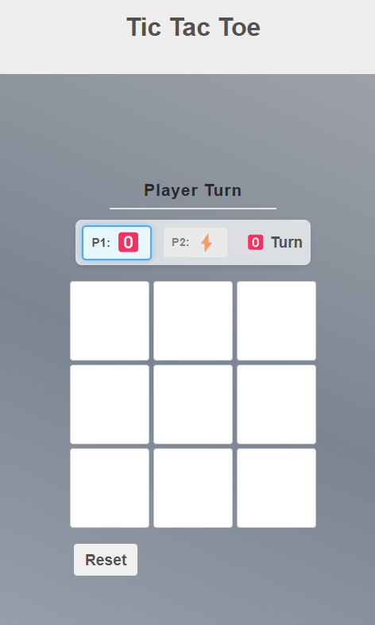

# Tic Tac Toe Game

A modern, interactive Tic Tac Toe game built with HTML, CSS, and JavaScript. This project features custom symbols (🅾️ and ⚡), player turn indicators, and animated win/draw announcements.



## Features

- **Custom Player Symbols**: Choose between 🅾️ and ⚡ symbols for each player
- **Interactive Game Board**: Clean and responsive 3x3 grid
- **Player Turn Indicator**: Visual display showing which player's turn is active
- **Custom Win/Draw Announcements**: Animated popup showing game results instead of browser alerts
- **Responsive Design**: Works well on both desktop and mobile devices
- **Reset Functionality**: Reset the game at any time using the reset button or ESC key

## How to Play

1. Open the game in your browser
2. Choose symbols for Player 1 and Player 2
3. Take turns placing your symbol on the 3x3 grid
4. The first player to get three of their symbols in a row (horizontally, vertically, or diagonally) wins
5. If all cells are filled without a winner, the game is a draw

## Game Controls

- **Click**: Place your symbol on the board
- **Reset Button**: Start a new game
- **ESC Key**: Reset the game at any time

## Technologies Used

- HTML5
- CSS3 (with animations, flexbox and grid layout)
- Vanilla JavaScript (no frameworks or libraries)

## Project Structure

```
tic-tac-toe/
│
├── assets/               # Images and icons
│   ├── tic tac.svg       # Favicon
│   └── tic tac.png       # Open Graph image
│
├── css/                  # Stylesheets
│   ├── normalize.css     # CSS reset
│   └── style.css         # Custom styles
│
├── index.html            # Main HTML file
├── main.js               # Game logic
└── README.md             # Project documentation
```

## Installation

No installation needed! Simply clone the repository and open `index.html` in your browser:

```bash
git clone https://github.com/yourusername/tic-tac-toe.git
cd tic-tac-toe
open index.html  # Or double-click the file in your file explorer
```


## License

[MIT License](LICENSE)

## Author

Hasanain Jaafar - [App link](https://hasanain-jaafar.github.io/Tic-Tac-Toe-JS/)

Feel free to contribute to this project by submitting issues or pull requests!